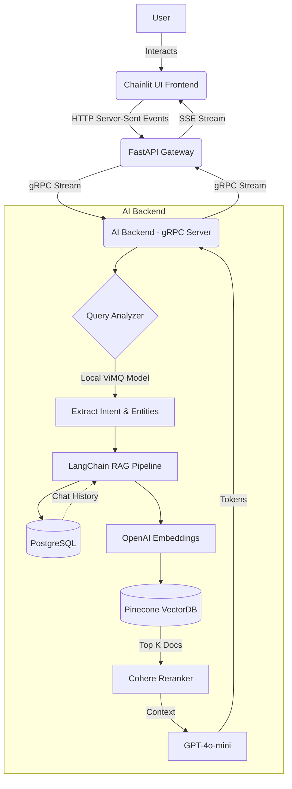

# BKMed: Advanced Medical QA Chatbot

This repository contains the source code for BKMed, an advanced medical question-answering chatbot system designed to provide accurate, context-aware health information. It utilizes a microservices architecture to process user queries, classify medical intents, retrieve relevant context, and generate comprehensive responses.

## Architecture Overview

The system is designed with a three-tier microservices architecture consisting of a User Interface, an API Gateway, and an AI Backend, communicating via HTTP Server-Sent Events (SSE) and gRPC.



## Technologies and Frameworks

### Frontend
- **Chainlit**: Provides the conversational user interface.

### Backend & Gateway
- **FastAPI**: Serves as the API Gateway handling Server-Sent Events (SSE) for streaming responses to the frontend.
- **gRPC / Protocol Buffers**: Facilitates high-performance, low-latency communication between the API Gateway and the AI Backend.
- **Python**: Core programming language for all services.

### AI & Machine Learning
- **LangChain**: Orchestrates the Retrieval-Augmented Generation (RAG) pipeline and dialogue state.
- **OpenAI API**: Provides the embedding model and the core Large Language Model (GPT-4o-mini).
- **Pinecone**: Acts as the vector database for storing and retrieving medical document embeddings.
- **Cohere**: Provides contextual compression and reranking of retrieved documents.
- **PyTorch / Transformers**: Used to run the local ViMQ model (based on PhoBERT) for medical intent and entity extraction.
- **Langfuse**: Used for LLM observability and tracing.

### Database
- **PostgreSQL (NeonDB)**: Stores persistent chat history across user sessions.

## Installation and Setup

### Prerequisites
- Python installed on a Windows environment.
- Git (with Git LFS installed for large model files).
- An active internet connection to download dependencies and external models.

### Step-by-Step Guide

1. **Clone the Repository**
   Ensure Git LFS is installed and initialized to fetch the local `.pt` models.
   ```bash
   git clone https://github.com/ThinHu/medical-QA-chatbot.git
   cd medical-QA-chatbot
   git lfs pull
   ```

2. **Create a Virtual Environment**
   It is recommended to run the project inside an isolated virtual environment.
   ```bash
   python -m venv venv
   .\venv\Scripts\activate
   ```

3. **Install Dependencies**
   Install the required Python packages from `requirements.txt`.
   ```bash
   pip install -r requirements.txt
   ```

4. **Environment Variables Configuration**
   Create a `.env` file in the root directory by duplicating the provided `.env.example` file.
   ```bash
   copy .env.example .env
   ```
   Edit the `.env` file and insert your respective API keys for OpenAI, Pinecone, Cohere, Langfuse, and the NeonDB URI.

## Execution

The system uses a batch script to automate the initialization of all three microservices.

1. **Run the Initialization Script**
   Execute the `start.bat` file from the command prompt or by double-clicking it in Windows Explorer.
   ```cmd
   start.bat
   ```

2. **Service Verification**
   The script will spawn three separate command windows for each service:
   - **AI Backend (gRPC Server)**: Runs on port `50051`.
   - **API Gateway (FastAPI)**: Runs on port `8080`.
   - **Chainlit UI**: Runs on port `8000`.

3. **Access the Application**
   Once all services have successfully started, the browser will automatically open `http://localhost:8000`, directing you to the BKMed conversational interface.

## License
Refer to the `LICENSE` file for distribution rights and limitations.
